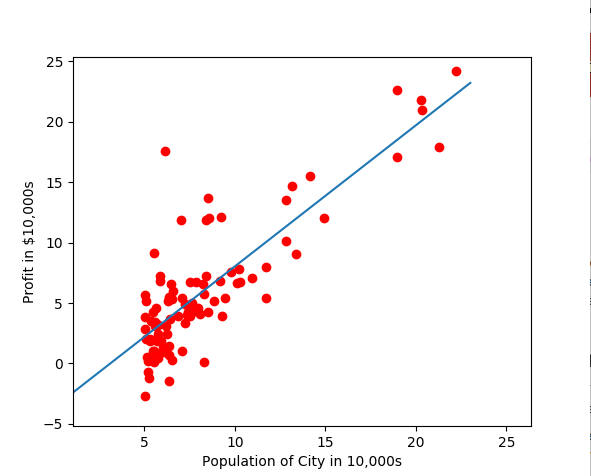

# Linear Regression

Practice implementing linear regression through gradient descent and normal equation. Data provided from Andrew Ng's Machine Learning course on Coursera.

### Gradient descent with single feature/variable

