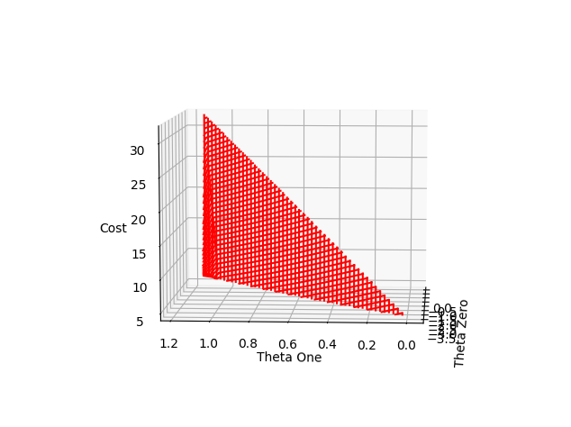
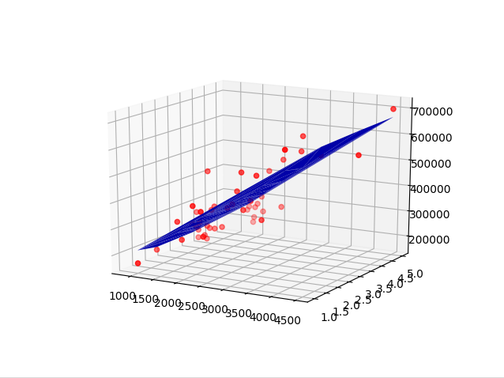

# Linear Regression

Practice implementing linear regression through gradient descent and normal equation. Data provided from Andrew Ng's Machine Learning course on Coursera.

## Single Variable

### Data set with hypothesis function

### Cost function

## Multi Variable

### Data set with hypothesis function

